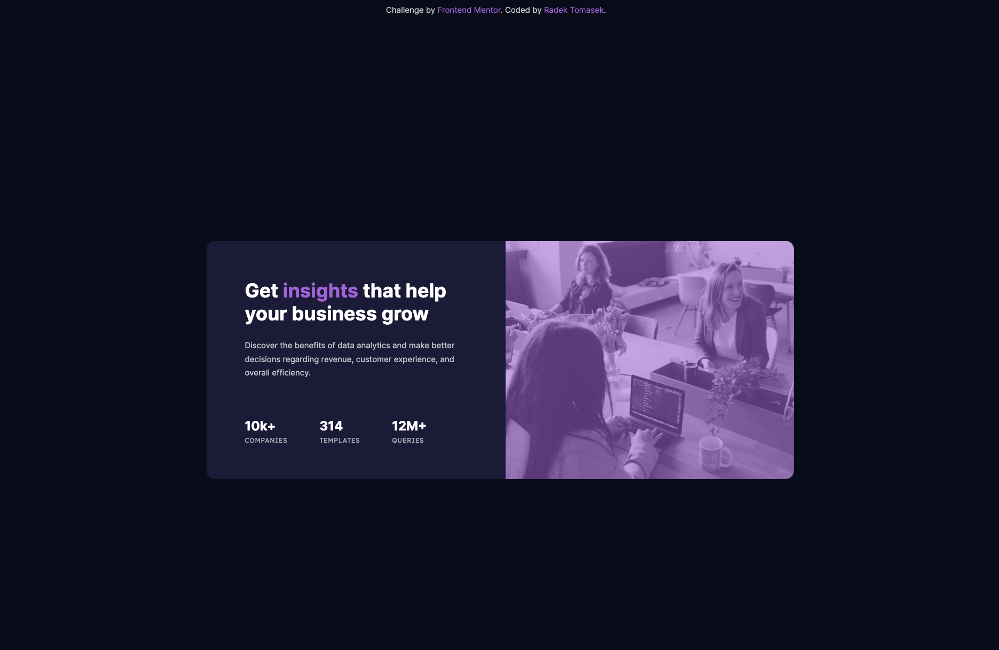

# Stats preview card component

This repository contains an implementation of one of the Frontend Mentor Challenges - [Stats preview card component](https://www.frontendmentor.io/challenges/stats-preview-card-component-8JqbgoU62) using HTML/CSS.

## Overview

### The Challenge

This challenge ([Stats preview card component](https://www.frontendmentor.io/challenges/stats-preview-card-component-8JqbgoU62)) was the seventh one I picked from the [Frontend Mentor](https://www.frontendmentor.io).

Althought it had been implemented in vanilla CSS, I tried to **focus on some specific things** related to **CSS variables**, **inheritance** and **CSS functions like `calc`**.

As usual, let me break things up in the next few paragraphs.

### Screenshots

There are a few screenshots captured within the various screen sizes.

#### Mobile Version

This is the **mobile version** as displayed on **iPhone 12 Pro**.


#### Tablet Version

This is the **tablet version** as displayed on **iPad Air**.


#### Desktop Version

This is the **desktop version** as displayed on a large screen.



### Links

- Solution URL: [https://github.com/radektomasek/fm-stats-preview-card-component](https://github.com/radektomasek/fm-stats-preview-card-component)
- Live Site URL: [https://radektomasek.github.io/stats-preview-card-component](https://radektomasek.github.io/stats-preview-card-component)

## My process

Building [this challenge](https://www.frontendmentor.io/challenges/stats-preview-card-component-8JqbgoU62) was a really nice experience. The first step was to create a layout. I felt it could be exclusively written in CSS Flexbox, as the challenge itself is a well contained card component, but I decided to put a CSS Grid for the main layout and made sure the layout sizes are calculated properly.

**I use CSS variables extensively**, therefore I decided to utilize them in more advance context and utilized `calc` for that reason. And it seemed to be working fine.

**Another big thing for me was to reduce a duplication**. The card uses rounded corners and border stuff is not inherited by default. In the past, I was duplicating the border definitions quite a bit, but at this time, I just utilized an explicit `inherit` value which did the trick for me too.

Speaking of CSS inheritance, I also made sure the border box is set properly by using the following construction:

```css
html {
  box-sizing: border-box;
}

*,
*::before,
*::after {
  box-sizing: inherit;
}
```

### Built with

- Semantic HTML5 markup
- Mobile-first workflow
- CSS Grid + CSS Flexbox
- [Parcel](https://parceljs.org) - a simple, zero config builder

### What I learned

For me, it's always tricky to decide whether an image is going to be a standard one or a background one. When digging more into that, I actually learned more about options like [object-fit](https://developer.mozilla.org/en-US/docs/Web/CSS/object-fit) and refreshed my mind about [responsive images](https://developer.mozilla.org/en-US/docs/Learn/HTML/Multimedia_and_embedding/Responsive_images).

I haven't used any of these in this project yet, but it's something I am going to definitely utilize coming forward, when I see a good fit for this use-case.

### Continued development

Once I find a challenge suite for reponsive images, I will make sure the appropriate techniques are applied.

## Author

- Frontend Mentor - [@radektomasek](https://www.frontendmentor.io/profile/radektomasek)
- Linkedin - [radektomasek](https://www.linkedin.com/in/radektomasek)
- Twitter - [@radek_tomasek](https://twitter.com/radek_tomasek)
